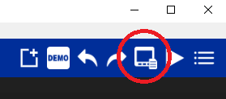
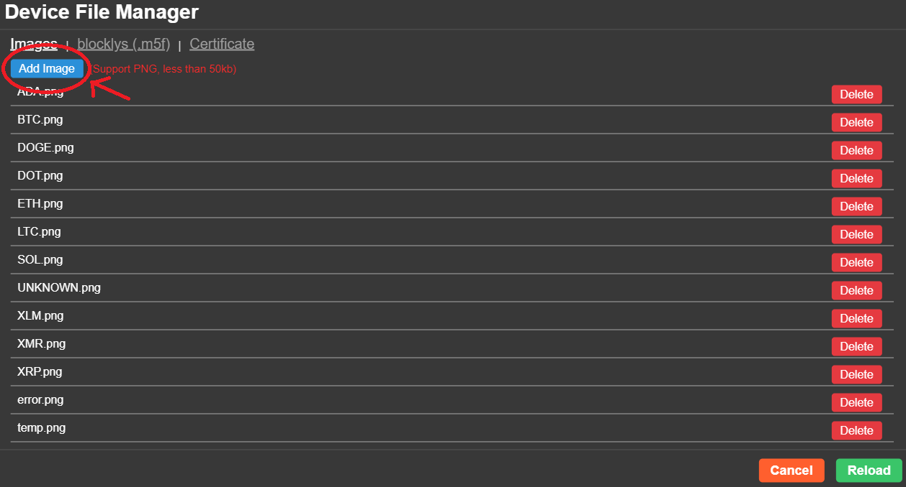

# Ročníkový projekt Hron

Mým cílem bylo udělat zábavný/zajímavý způsob jak sledovat cenu různých kryptoměn.

V tomto souboru najdete 2 složky se dvěmi projekty, jeden pro M5Stack ATOM a druhý pro M5Stack Core 2.

> *Kód pro **M5Stack ATOM** pouze vyžaduje konfiguraci údajů k wifi v zdrojovém kódu a náhle můžetě program zkusit.*

> *Kód pro **M5Stack Core 2** také vyžaduje konfiguraci wifi ve zdrojovém kódu, ale ještě musíte nahrát jednotlivé obrázky ikonek kryptoměn na samotný M5Stack.*

Program využit na správu souborů a spouštení kódu je [UiFlow](https://shop.m5stack.com/pages/download).

> #### Nahrávání obrázku na M5Core2 | 1/2
> </img>

> #### Nahrávání obrázku na M5Core2 | 2/2
> Bohužel se obrázky musí nahrávat zvlášt, celá složka nahrát nelze, naštěstí to je rychlá práce
> 
> </img>

### *Hardware:*

- [M5Stack Core 2](https://rpishop.cz/m5stack/3066-m5stack-core2-esp32-iot-vyvojova-sada.html)
- [M5Stack ATOM Matrix](https://rpishop.cz/m5stack/2766-m5stack-atom-matrix-esp32-development-kit.html)

### *Software:*
- [UiFlow a M5Burner](https://shop.m5stack.com/pages/download)
- ### *Setup:*
- [Setup návod CORE2](https://docs.m5stack.com/en/quick_start/core2/uiflow)
- [Setup návod ATOM MATRIX](https://docs.m5stack.com/en/quick_start/atom/uiflow)
- UiFlow je napojeno lokálně přes USB, ne přes API klíč

### *Zdroje:*

- [Knihovna requests](https://docs.python-requests.org/en/latest/) na získání odpovědi od API (ve skutečnosti micro python knihovna urequests, syntax je ale skoro identický)
- [Knihovna JSON](https://docs.python.org/3/library/json.html) na manipulování dat od API
